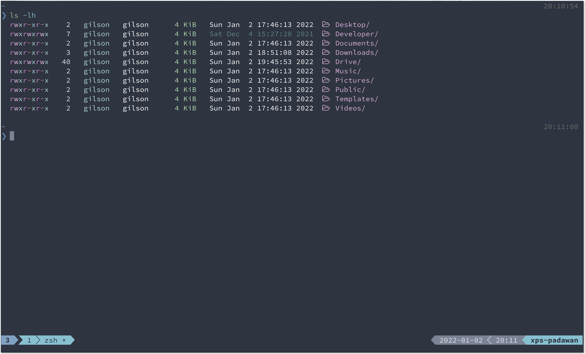

# Nord for colorls

This project prepare a Nord theme for colorls



## Install

1. Clone this repo or [use the .zip download](https://github.com/gilsondev/nord-colorls/archive/refs/heads/main.zip) of Github.

```bash
git clone https://github.com/gilsondev/nord-colorls.git
```

2. Activate this theme

- Copy the `dark_colors.yaml` into the colorls directory:

```bash
cd nord-colorls
cp dark_colors.yaml ~/.config/colorls/dark_colors.yaml
```

3. Use the `--dark` option when execute the `colorls`. A suggestion is create a _alias_:

```bash
colorls --dark
```
